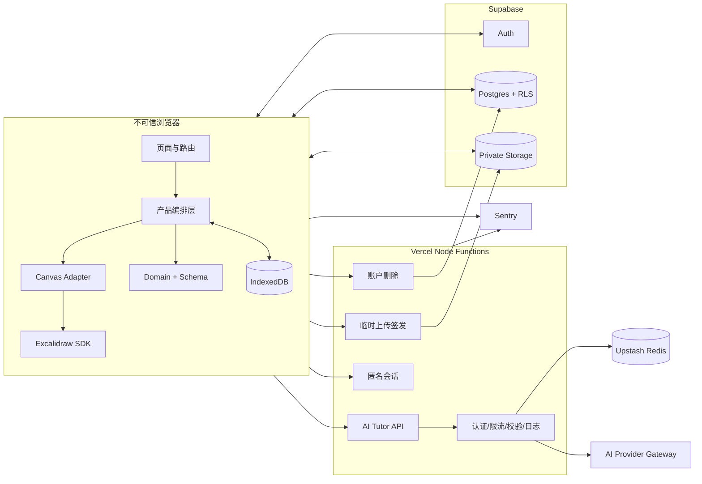

# Easy to learn：MVP 方案设计

> 阶段：阶段 2——方案设计
> 状态：已确认并冻结
> 日期：2026-09-22
> 上游依据：`01-需求评审与决策记录.md`、`Smart-Canvas-项目重开发设计文档.md`
> 适用范围：生产 MVP；Phase 2 功能不在本文实现范围

## 1. 设计目标

本方案只实现已经确认的 MVP：中文 AI 学习白板、多画板、Solve/Hint/Explain step、安全 Tutor DSL、本地优先保存、Supabase 云同步、私有图片存储、配额、导出和账户删除。

设计优先级依次为：数据不丢失、安全边界清晰、核心路径可测试、Excalidraw 可升级、界面响应稳定。以下内容明确不进入 MVP：多人实时协作、CRDT、AI 连续对话、移动端完整 AI 选区、课程系统、分享空间和元素级冲突合并。

## 2. 总体架构



### 2.1 信任边界

- 浏览器中的 owner ID、board ID、revision、MIME、文件尺寸和 AI DSL 一律视为不可信。
- 浏览器只能持有 Supabase anon key；AI Provider、Upstash、Sentry auth token 和 Supabase service role 只能在服务端。
- 普通画板 CRUD 使用用户 JWT + RLS；快照保存通过原子 RPC，不使用客户端无条件 upsert。
- `api/ai/tutor` 不持有 Supabase service role；临时上传签发和账户删除分别部署为独立函数并最小化密钥权限。
- 模型无工具调用权限，不能读取 URL、数据库、对象存储或环境变量。
- 所有第三方日志使用字段白名单，不记录题目、图片、Base64、JWT、签名 URL 或密钥。

### 2.2 运行时拓扑

- Web：Vite 构建的 SPA，`/canvas` 路由懒加载 Excalidraw、KaTeX 和 Tutor UI。
- API：Vercel Node Functions，显式 Node runtime、区域、超时和请求体限制。
- Auth/DB/Storage：Supabase；本地、Preview、Production 使用隔离项目。
- 限流：Upstash Redis，使用原子脚本完成 5 分钟窗口、每日配额和 requestId 幂等。
- AI：通过统一 `TutorModel` 接口接入 Gemini 与 OpenAI-compatible 服务；按 `AI_PROVIDERS` 顺序执行，只有超时、网络或供应商故障才自动回退。模型输出继续经过同一 Tutor DSL 校验，实际 provider/model 写入元数据。
- Provider 链最多 3 个节点，累计超时预算不超过 25 秒；Tutor Function 时限为 60 秒，为现有的一次格式纠错保留执行空间。
- 教学拆解策略由项目级 `canvas-tutor-planner` Skill 管理；生产运行时静态导入其版本化 Prompt 注册表。环境只能选择已注册版本，不能用任意版本号伪造审计元数据。Skill 不替代 Tutor DSL、Zod 校验或安全渲染。

## 3. 仓库结构与依赖方向

```text
Easy-to-learn/
├─ apps/
│  └─ web/
│     ├─ src/app/                  # Router、Provider、启动流程
│     ├─ src/pages/                # Home/Login/Boards/Canvas/AuthCallback
│     ├─ src/features/auth/
│     ├─ src/features/boards/
│     ├─ src/features/canvas/
│     ├─ src/features/ai-tutor/
│     ├─ src/features/tutor-board/
│     ├─ src/features/persistence/
│     ├─ src/features/account/
│     └─ src/shared/
├─ api/
│  ├─ anonymous/session.ts
│  ├─ ai/tutor.ts
│  ├─ ai/upload-ticket.ts
│  ├─ ai/feedback.ts
│  ├─ account/deletion.ts
│  ├─ health.ts
│  └─ _shared/                     # auth、quota、logger、errors、headers
├─ packages/
│  ├─ domain/                      # 类型、Zod schema、迁移、错误码
│  ├─ canvas-adapter/              # Excalidraw 公共 API 薄适配
│  └─ ui/                          # 产品 UI 原语，不依赖画布内部状态
├─ skills/
│  └─ canvas-tutor-planner/        # 教学拆解 Skill、运行契约、Prompt 注册表
├─ supabase/
│  ├─ migrations/
│  ├─ tests/                       # RLS、RPC、Storage policy SQL 测试
│  └─ config.toml
├─ tests/
│  ├─ e2e/
│  ├─ fixtures/
│  └─ golden/                      # 匿名化黄金题集
├─ docs/
├─ package.json
└─ pnpm-workspace.yaml
```

依赖方向固定为：页面/feature 可以依赖 `domain`、`canvas-adapter`、`ui`；`canvas-adapter` 只依赖 Excalidraw 公共包和 `domain` 的必要值对象；`domain` 不依赖 React、DOM、Supabase 或 Gemini；API 依赖 `domain` 与只读 Tutor Skill Prompt 注册表，不依赖 Web；Skill 不依赖 Provider SDK 或前端组件。

禁止跨 feature 深层导入。每个模块只通过公开 `index.ts` 暴露接口。业务代码不得直接从 Excalidraw 内部源码路径导入。

## 4. 前端模块设计

| 模块 | 主要职责 | 对外接口 | 禁止事项 |
|---|---|---|---|
| `app` | 路由、Provider、错误边界、懒加载 | `AppRouter` | 不操作场景元素 |
| `auth` | Session 恢复、登录注册、OAuth、redirect 白名单 | `AuthProvider`、`useAuth` | 不存明文令牌 |
| `boards` | 列表、创建、重命名、删除、最近画板 | `BoardRepository` | 不写快照内容 |
| `canvas` | 编辑器装配、选区、主题、UserBar | `CanvasPage` | 不包含 AI prompt |
| `canvas-adapter` | API 引用、坐标转换、选区过滤、PNG 导出 | `CanvasPort` | 不依赖页面或 Supabase |
| `ai-tutor` | 请求状态机、取消、幂等、quota UI | `TutorService` | 不直接渲染模型原文 |
| `tutor-board` | DSL 渲染、锚定、拖动、步骤、过期判断 | `TutorBoardLayer` | 不使用 HTML 注入 |
| `persistence` | IndexedDB、outbox、asset、云同步、冲突 | `PersistenceService` | 不持久化 ephemeral state |
| `account` | 导出、删除请求、冷静期取消 | `AccountService` | 不持有 service role |
| `ui` | Button、Dialog、Toast、状态组件 | 无业务状态组件 | 不依赖 Excalidraw |

### 4.1 路由

| 路由 | 权限 | 行为 |
|---|---|---|
| `/` | 公开 | 官网；不加载 Excalidraw |
| `/login` | 公开 | 登录/注册；已登录则按安全 redirect 跳转 |
| `/boards` | 登录 | 画板列表；游客转 `/login?redirect=/boards` |
| `/canvas` | 公开 | 游客创建/恢复本地临时板；登录用户打开最近板或创建新板 |
| `/canvas/:boardId` | 条件 | 云端 UUID 需 RLS；`local_` 前缀只查本机 IndexedDB |
| `/auth/callback` | 公开 | PKCE 回调；只恢复站内白名单路径 |

本地 ID 使用 `local_<uuid>`，云端使用标准 UUID。客户端不得把本地 ID 发送给 Supabase RPC。

### 4.2 三个状态域

1. Excalidraw 状态：elements、files、selection、viewport、编辑历史。
2. 产品领域状态：tutor boards、source relation、step、AI request。
3. 持久化状态：local revision、remote revision、outbox、asset upload、conflict。

领域状态使用 React reducer + Context。远端列表和认证相关请求使用 TanStack Query。Excalidraw 场景不复制进 Query cache 或全局 reducer。

## 5. 领域模型

### 5.1 画板快照

```ts
interface PersistedCanvasV2 {
  schemaVersion: 2;
  boardId: string;
  revision: number;
  excalidraw: {
    elements: readonly unknown[];
    appState: PersistedAppState;
  };
  assets: AssetManifestItem[];
  tutorBoards: PersistedTutorBoardV2[];
  updatedAt: string;
}

interface PersistedAppState {
  viewBackgroundColor: string;
  gridSize: number | null;
  gridStep: number;
  gridModeEnabled: boolean;
  objectsSnapModeEnabled: boolean;
}

interface AssetManifestItem {
  fileId: string;
  objectPath: string;
  contentHash: string;
  mimeType: "image/png" | "image/jpeg" | "image/webp";
  byteSize: number;
  width: number;
  height: number;
}
```

`elements` 在恢复时必须通过 Excalidraw 官方 `restore` 链路处理；外层 schema 限制数组长度、JSON 总尺寸和允许元素类型。selection、hover、open menu、editing element、pointer、loading、scroll、zoom 不进入云快照。viewport 进入 IndexedDB 的设备偏好表。

### 5.2 辅导板

```ts
interface PersistedTutorBoardV2 {
  id: string;
  requestId?: string;
  title: string;
  result: TutorResultV1;
  stepIndex: number;
  sceneAnchor: { sceneX: number; sceneY: number };
  anchorMode: "absolute" | "follow-source";
  source: {
    elementIds: string[];
    bounds: { x: number; y: number; width: number; height: number };
    contentHash: string;
    relativeOffset?: { x: number; y: number };
    status: "active" | "stale" | "orphaned";
  };
  parentTutorBoardId?: string;
  targetStepId?: string;
  createdAt: string;
  updatedAt: string;
}
```

loading、failed、cancelled 是临时请求状态，不能序列化为 `PersistedTutorBoardV2`。关闭辅导板立即产生 durable change。
`requestId` 只关联服务端已完成请求，用于 24 小时内提交结构化反馈；字段可选以兼容已经持久化的旧辅导板。

### 5.3 Tutor DSL

通用限制：标题 1–120 字符；步骤 1–12；每步 blocks 1–30；paragraph/callout 1–2,000 字符；list 1–20 项且单项不超过 500 字符；LaTeX 不超过 2,000 字符；响应 JSON 不超过 100 KiB；所有 object 使用 `additionalProperties: false`。

```ts
type TutorBlock =
  | { type: "paragraph"; text: string }
  | { type: "math"; latex: string; display: boolean }
  | { type: "list"; style: "ordered" | "unordered"; items: string[] }
  | { type: "callout"; tone: "info" | "warning" | "success"; text: string }
  | { type: "diagram"; diagram: DiagramV1 };

type DiagramV1 = CoordinatePlaneV1 | GeometryDiagramV1 | FlowDiagramV1;
type DiagramColor = "neutral" | "blue" | "green" | "amber" | "red" | "purple";

interface TutorStepV1 {
  id: string;
  title: string;
  blocks: TutorBlock[];
  explanation?: string;
  hintLevel?: 1 | 2 | 3;
}

interface TutorResultV1 {
  schemaVersion: 1;
  mode: "solve" | "hint" | "explain_step";
  title: string;
  steps: TutorStepV1[];
  hintLevel?: 3;
  metadata: {
    model: string;
    promptVersion: string;
    generatedAt: string;
  };
}
```

#### CoordinatePlaneV1

```ts
interface CoordinatePlaneV1 {
  type: "coordinate-plane";
  xRange: [number, number];
  yRange: [number, number];
  showGrid: boolean;
  showAxes: boolean;
  points: Array<{ id: string; x: number; y: number; label?: string; color: DiagramColor }>;
  segments: Array<{ from: [number, number]; to: [number, number]; label?: string; color: DiagramColor }>;
}
```

范围端点限定在 `[-10000, 10000]` 且前者小于后者；点最多 50 个、线段最多 50 条；不接受任意函数表达式、URL、SVG 或脚本。

#### GeometryDiagramV1

```ts
type GeometryPrimitiveV1 =
  | { kind: "point"; id: string; at: [number, number]; label?: string; color: DiagramColor }
  | { kind: "segment"; from: [number, number]; to: [number, number]; label?: string; color: DiagramColor }
  | { kind: "polygon"; points: Array<[number, number]>; label?: string; color: DiagramColor; filled: boolean }
  | { kind: "circle"; center: [number, number]; radius: number; label?: string; color: DiagramColor }
  | { kind: "angle"; vertex: [number, number]; from: [number, number]; to: [number, number]; label?: string; color: DiagramColor };

interface GeometryDiagramV1 {
  type: "geometry";
  viewport: { xMin: number; xMax: number; yMin: number; yMax: number };
  primitives: GeometryPrimitiveV1[];
}
```

坐标限定在 `[-10000, 10000]`；primitive 最多 100 个；polygon 为 3–20 点；圆半径大于 0 且不超过 10,000；文本标签不超过 80 字符。

#### FlowDiagramV1

```ts
interface FlowDiagramV1 {
  type: "flow";
  direction: "TB" | "LR";
  nodes: Array<{
    id: string;
    label: string;
    shape: "rectangle" | "rounded" | "diamond";
    color: DiagramColor;
  }>;
  edges: Array<{
    id: string;
    from: string;
    to: string;
    label?: string;
    style: "solid" | "dashed";
  }>;
}
```

节点最多 30 个、边最多 60 条；ID 匹配 `^[A-Za-z0-9_-]{1,40}$`；边必须引用已存在节点；禁止自环和重复边；节点文字不超过 120 字符。

### 5.4 Hint 语义

`mode=hint` 的 `steps` 必须恰好为 3 步，各 step 的 `hintLevel` 分别为 1、2、3，结果级 `hintLevel` 固定为 3。客户端初始只显示第一级，后续本地揭示，不再次消耗配额；三级均不得包含最终数值答案或完整证明。`solve` 至少 1 步且 step 不携带 hintLevel；`explain_step` 必须携带父辅导板与目标 step ID。

## 6. IndexedDB 设计

数据库名：`easy-to-learn`，初始 schema version：1。

| Object store | Key | 内容 |
|---|---|---|
| `boards` | `boardId` | 最新 V2 快照、localRevision、remoteRevision、dirty、更新时间 |
| `assets` | `[boardId,fileId]` | Blob、hash、MIME、尺寸、uploadState、objectPath |
| `outbox` | 自增 ID | boardId、baseRevision、localRevision、操作类型、重试次数、nextAttemptAt |
| `preferences` | key | 主题、每画板 viewport、最近画板 ID |
| `migrationBackups` | ID | V1 原始数据、来源、创建时间、清理时间、状态 |
| `conflictCopies` | ID | 本地冲突快照、远端 revision、创建时间 |

- durable change 必须在同一 IndexedDB 事务内更新 `boards` 和写入/合并 outbox。
- 同一 board 只保留一个待同步 snapshot 任务；删除和迁移任务不能被 snapshot 合并覆盖。
- assets 必须先本地落盘，再允许快照引用；云端必须先上传缺失资产，再提交快照。
- IndexedDB 配额不足、损坏或迁移失败时停止云写入，提供原始数据下载和显式安全重置。

## 7. Postgres 与 Storage 设计

### 7.1 `boards`

| 字段 | 类型 | 约束 |
|---|---|---|
| `id` | uuid | PK，`gen_random_uuid()` |
| `owner_id` | uuid | FK `auth.users(id)`，cascade delete |
| `title` | text | 1–120 字符，默认“未命名画板” |
| `snapshot_json` | jsonb | 非空，V2 空快照作为默认创建值 |
| `schema_version` | integer | 固定为 2 |
| `revision` | bigint | 非负，初始 0 |
| `last_editor_id` | text | 设备生成的随机 editor ID，不是用户 ID |
| `created_at` | timestamptz | server default now |
| `updated_at` | timestamptz | server default now |

索引：`(owner_id, updated_at desc)`；每用户最多 100 个活跃画板，创建 RPC 内原子检查。单个未压缩 snapshot JSON 最大 10 MiB，超限返回 `BOARD_TOO_LARGE`。

### 7.2 `board_assets`

| 字段 | 类型 | 约束 |
|---|---|---|
| `id` | uuid | PK |
| `board_id` | uuid | FK boards，cascade delete |
| `file_id` | text | 1–100 字符 |
| `object_path` | text | 唯一稳定私有路径 |
| `content_hash` | text | SHA-256，小写十六进制 |
| `mime_type` | text | png/jpeg/webp 白名单 |
| `byte_size` | bigint | 1–10 MiB |
| `width`,`height` | integer | 各 1–8192；总像素不超过 32 MP |
| `created_at` | timestamptz | server default now |

唯一约束：`(board_id,file_id)` 和 `(board_id,content_hash)`。每个画板最多 100 MiB 资产，每用户最多 1 GiB；RPC/上传签发同时校验，前端提示可操作错误。

### 7.3 `account_deletion_requests`

| 字段 | 类型 | 约束 |
|---|---|---|
| `user_id` | uuid | PK，FK auth.users |
| `requested_at` | timestamptz | 非空 |
| `execute_after` | timestamptz | `requested_at + 7 days` |
| `status` | text | `pending/cancelled/executing/completed/failed` |
| `updated_at` | timestamptz | 非空 |

用户只可读取自己的 pending 状态；创建、取消和执行必须走服务端函数。清理任务执行数据库、Storage 和 Auth 删除，并写不含内容的审计事件。

### 7.4 `ai_feedback`

| 字段 | 类型 | 约束 |
|---|---|---|
| `id` | uuid | PK |
| `request_id` | uuid | 唯一 |
| `actor_hash` | text | 不可逆摘要 |
| `rating` | smallint | `-1` 或 `1` |
| `category` | text | 可空；`incorrect_answer/unclear_explanation/unsafe_content/other` |
| `model`、`prompt_version`、`schema_version` | text/integer | 非空 |
| `created_at` | timestamptz | 非空 |

不保存自由文本、题目或图片；保留 90 天。

### 7.5 `asset_cleanup_jobs`

| 字段 | 类型 | 约束 |
|---|---|---|
| `id` | uuid | PK |
| `object_path` | text | 唯一，必须属于允许的私有 bucket |
| `reason` | text | `board_deleted/orphaned_upload/account_deleted/temp_expired` |
| `not_before` | timestamptz | 最早执行时间 |
| `attempts` | integer | 初始 0，最大 10 |
| `status` | text | `pending/running/completed/failed` |
| `last_error_code` | text | 可空，不保存供应商原始正文 |
| `created_at`,`updated_at` | timestamptz | 非空 |

只有受控清理函数可读写该表；用户删除成功不依赖 Storage 同步成功。完成记录保留 30 天，失败任务触发告警。

### 7.6 RLS 与 RPC

- `boards` 的 select/insert/update/delete 均要求 `auth.uid() = owner_id`。
- `board_assets` 通过关联 board 验证 owner；禁止按 hash 跨用户查询。
- `save_board(board_id, expected_revision, snapshot, asset_manifest, editor_id)` 在单事务内锁行、校验 owner/revision/manifest、更新快照并将 revision 加一。
- `create_board(title)` 原子校验用户画板数量并返回空 V2 快照。
- `rename_board(board_id,title)` 校验 owner 和长度。
- `delete_board(board_id)` 在删除前把关联 object paths 原子写入 `asset_cleanup_jobs`，再删除数据库记录；Storage 清理失败不回滚已经确认的数据库删除。
- RPC 如使用 `SECURITY DEFINER`，固定 `search_path`，撤销 public execute，只授予 authenticated，并编写越权 SQL 测试。

### 7.7 Storage

- `board-assets`：私有 bucket，路径 `<ownerId>/<boardId>/<contentHash>`。
- `ai-temp`：私有 bucket，路径 `<actorHash>/<requestId>/<contentHash>`，最长 TTL 1 小时。
- 普通画板资产由用户 JWT + Storage policy 上传；路径必须能关联自己的 board。
- 临时 AI 上传先调用签发接口取得一次性 upload ticket，客户端直传 Storage；AI API 只接受与当前 actor/requestId 绑定且未过期的 path。
- 定时任务删除超过 1 小时的 AI 临时对象和超过 24 小时仍未被 manifest 引用的画板孤儿资产。

### 7.8 完整导出格式

标准导出直接生成 `.excalidraw`。完整导出生成 `.easy-to-learn.json`，只在用户主动导出时把图片转为 Base64：

```ts
interface EasyToLearnExportV1 {
  format: "easy-to-learn";
  exportVersion: 1;
  exportedAt: string;
  canvas: PersistedCanvasV2;
  embeddedAssets: Array<{
    fileId: string;
    mimeType: "image/png" | "image/jpeg" | "image/webp";
    contentHash: string;
    base64: string;
  }>;
}
```

Base64 只允许出现在用户下载文件，禁止写回 IndexedDB 快照、Postgres、日志或监控。导入时逐个校验 hash、MIME、尺寸和总体积；失败时不修改当前画板。浏览器支持 File System Access API 时流式写文件，否则在 100 MiB 导出上限内生成 Blob 下载。

## 8. API 契约

统一响应头包含 `X-Request-Id`。成功响应使用 `{ "data": ... }`；错误响应固定为：

```ts
interface ApiErrorResponse {
  requestId: string;
  code: ApiErrorCode;
  message: string;
  retryable: boolean;
  details?: Record<string, string | number | boolean>;
}
```

`details` 只允许白名单字段，不返回堆栈、供应商原始响应或内部路径。

### 8.1 `POST /api/anonymous/session`

用途：为游客签发匿名会话。无入参。成功返回：

```json
{
  "data": {
    "expiresAt": "2026-10-22T00:00:00.000Z",
    "quota": { "dailyLimit": 3, "remaining": 3, "nextAllowedAt": null }
  }
}
```

会话 ID 只存放于 `HttpOnly; Secure; SameSite=Lax` 签名 cookie，有效期 30 天；响应不暴露原始 ID。重复调用复用有效会话。

### 8.2 `POST /api/ai/upload-ticket`

入参：`requestId`、`contentHash`、`mimeType`、`byteSize`、`width`、`height`。限制 MIME、10 MiB、8192 边长和 32 MP。成功返回一次性上传 URL、opaque `uploadPath` 和 10 分钟过期时间。上传对象 1 小时后自动清理。

### 8.3 `POST /api/ai/tutor`

认证：Supabase Bearer JWT 或匿名签名 cookie。Content-Type 为 JSON。

```ts
interface TutorRequest {
  requestId: string;
  schemaVersion: 1;
  boardId: string;
  mode: "solve" | "hint" | "explain_step";
  text?: string;
  image?: {
    mimeType: "image/png" | "image/jpeg";
    base64?: string;
    uploadPath?: string;
  };
  locale: "zh-CN";
  source: {
    elementIds: string[];
    selectionBounds: { x: number; y: number; width: number; height: number };
    contentHash: string;
  };
  parentTutorBoardId?: string;
  targetStepId?: string;
}
```

校验规则：text/image 至少一个；text 最大 10,000 字符；内联图片 Base64 解码后最大 1.5 MiB；elementIds 1–500；Explain step 必须有两个父字段，其他模式禁止携带；登录用户 boardId 必须属于自己，游客 boardId 必须为 `local_` ID。

成功 `200`：

```ts
interface TutorResponse {
  data: {
    requestId: string;
    result: TutorResultV1;
    quota: { dailyLimit: 3; remaining: number; nextAllowedAt: string };
  };
}
```

同 actor + requestId 在 24 小时内返回相同已验证结果，不重复调用模型或扣配额。模型 JSON 允许一次同模型纠错重试；纠错属于同一次配额。首版非流式返回。

### 8.4 `POST /api/ai/feedback`

入参：`requestId`、`rating: -1 | 1`、可选 `category` 枚举（`incorrect_answer/unclear_explanation/unsafe_content/other`）。无自由文本和附件。成功返回 `204`；重复 requestId 为幂等更新。只接受当前身份在 24 小时幂等缓存内已完成的请求，模型、提示词和 schema 版本从服务端结果读取，不信任客户端值。

### 8.5 `POST /api/account/deletion`

要求登录且最近 10 分钟内完成重新认证。入参为空；返回 `202` 和 `executeAfter`。重复请求返回现有 pending 记录。

### 8.6 `DELETE /api/account/deletion`

要求登录；只允许在 `executeAfter` 前取消。成功返回 `204`，已进入 executing 返回 `409 DELETION_ALREADY_STARTED`。

### 8.7 `GET /api/health`

只返回应用版本、commit SHA 和依赖的 `ok/degraded`，不返回环境变量、数据库 schema 或供应商凭据。公开请求不主动探测付费 AI。

### 8.8 Supabase 客户端操作

| 操作 | 方式 | 输出 |
|---|---|---|
| 列出画板 | `boards` select，仅元数据列 | 分页列表 |
| 创建 | `create_board` RPC | board ID、revision 0 |
| 重命名 | `rename_board` RPC | 更新时间 |
| 读取 | `boards` select by ID | V2 snapshot |
| 保存 | `save_board` RPC | 新 revision |
| 删除 | `delete_board` RPC | 删除确认 |
| 获取资产 | 私有 signed URL | 短期下载 URL，不持久化 |

### 8.9 错误码

| HTTP | code | retryable | 场景 |
|---:|---|---:|---|
| 400 | `INVALID_INPUT` | 否 | schema 或业务入参错误 |
| 400 | `INVALID_REDIRECT` | 否 | 非白名单 redirect |
| 401 | `AUTH_REQUIRED` | 否 | 缺少有效身份 |
| 401 | `INVALID_ANON_SESSION` | 是 | 匿名会话失效，可重新签发 |
| 403 | `FORBIDDEN` | 否 | 越权访问 |
| 404 | `BOARD_NOT_FOUND` | 否 | 画板不存在或不可见 |
| 409 | `REVISION_CONFLICT` | 否 | expected revision 不一致 |
| 409 | `DELETION_ALREADY_STARTED` | 否 | 已不能取消账户删除 |
| 413 | `PAYLOAD_TOO_LARGE` | 否 | 请求或内联图片过大 |
| 413 | `BOARD_TOO_LARGE` | 否 | 快照超过 10 MiB |
| 415 | `UNSUPPORTED_MEDIA_TYPE` | 否 | MIME 不支持 |
| 422 | `INVALID_MODEL_OUTPUT` | 是 | 模型输出未通过 DSL 校验 |
| 422 | `UNSUPPORTED_SCHEMA` | 否 | schemaVersion 不兼容 |
| 429 | `RATE_LIMITED` | 是 | 5 分钟窗口未结束 |
| 429 | `QUOTA_EXCEEDED` | 否 | 当日 3 次用尽 |
| 429 | `STORAGE_QUOTA_EXCEEDED` | 否 | 资产配额超限 |
| 502 | `AI_PROVIDER_ERROR` | 是 | AI Provider 非预期失败或全部回退耗尽 |
| 503 | `DEPENDENCY_UNAVAILABLE` | 是 | Supabase/Redis 暂不可用 |
| 504 | `AI_TIMEOUT` | 是 | AI 超时 |
| 500 | `INTERNAL_ERROR` | 是 | 未分类服务端错误 |

## 9. 核心状态机

### 9.1 AI 请求

```text
idle -> preparing-selection -> uploading-image -> requesting -> validating -> succeeded
  \-> failed
  \-> cancelled
```

- 每个请求使用 AbortController；新请求、关闭 loading UI 或页面离开时取消。
- 返回时再次验证当前 board、source contentHash 和 requestId；过期结果丢弃，不覆盖新状态。
- 只有 succeeded 的结果转换为持久辅导板。

### 9.2 本地保存与云同步

```text
clean -> local-saving -> dirty -> syncing-assets -> syncing-snapshot -> synced
                         |              |                 |
                         +-> offline <--+-----------------+
                         +-> retrying
                         +-> conflict
                         +-> failed-local
```

- durable change 立即写 IndexedDB；云端同步 debounce 3 秒。
- 单画板只有一个同步执行者；多标签页通过 BroadcastChannel 选举临时 writer 并广播 revision。
- 页面关闭只依赖已经完成的 IndexedDB 事务，不依赖网络。
- revision conflict 立即停止自动写入并创建 conflict copy。

### 9.3 来源关系

- 所有 source element 存在且 hash 相同：`active`。
- 元素存在但内容/数量/hash 改变：`stale`。
- 所有来源被删除：`orphaned`。
- `follow-source` 只在来源整体 bounds 平移且内容 hash 不变时跟随；缩放或内容修改触发 stale，不自动重算答案。

## 10. 安全设计

- OAuth 使用 Supabase PKCE/state；callback URL 按环境白名单配置。
- redirect 只接受以 `/` 开头、不得以 `//` 开头的允许路由，解析后必须同源。
- 匿名 cookie 使用 HMAC 签名、key rotation version、HttpOnly、Secure、SameSite=Lax。
- 写 API 校验 `Origin`；只允许配置的应用 origin。Bearer JWT API 不依赖 cookie 身份完成用户授权。
- Tutor DSL 前后端共享 Zod schema；KaTeX 使用 strict，`trust: false`，禁止宏扩展和外部资源。
- Diagram renderer 只绘制受控 React/SVG 属性；模型不得提供原始 SVG、CSS、URL、event handler 或 `foreignObject`。
- CSP 至少为 `default-src 'self'`，按 Supabase/Sentry 所需最小开放 connect-src；禁止 unsafe-eval，生产 source map 不公开。
- 安全响应头包含 HSTS、Referrer-Policy、Permissions-Policy、X-Content-Type-Options 和 frame-ancestors。
- 日志 actor 使用带独立盐的不可逆摘要；request ID 贯穿浏览器、API、Redis 和 AI Provider metadata。
- CI 执行依赖漏洞、密钥、RLS、Storage policy、DSL fuzz 和构建产物密钥扫描。

## 11. 依赖冻结

以下版本以 2026-09-22 注册表结果为阶段 3 初始锁定值；全部写入 lockfile，不使用 `latest`。只有兼容性尖峰失败时才提交 ADR 调整。

| 依赖 | 版本 | 用途 |
|---|---:|---|
| Node.js | 24.21.0 | LTS runtime |
| pnpm | 11.25.0 | workspace/package manager |
| React / React DOM | 19.3.0 | Web UI |
| React Router DOM | 7.18.4 | SPA 路由 |
| Vite | 8.3.0 | 构建与开发服务器 |
| TypeScript | 6.0.3 | 类型系统；参见 ADR-001 |
| `@vitejs/plugin-react` | 6.1.1 | React 编译插件 |
| `@excalidraw/excalidraw` | 0.18.1 | 画布 SDK |
| `@supabase/supabase-js` | 2.116.0 | Auth/DB/Storage |
| `@tanstack/react-query` | 5.103.2 | 远端请求状态 |
| Zod | 4.6.5 | schema 单一来源 |
| idb | 8.0.3 | IndexedDB 封装 |
| KaTeX | 0.18.7 | 数学公式 |
| `@google/genai` | 2.24.0 | 可选 Gemini Provider 的 server SDK |
| `@upstash/redis` | 1.39.0 | 配额、限流、幂等 |
| `@sentry/react` | 10.75.2 | 前端监控 |
| Vitest | 5.0.1 | 单元/组件测试 |
| Testing Library React | 16.3.3 | 组件测试 |
| MSW | 2.15.0 | API mock |
| Playwright | 1.63.0 | E2E |

Excalidraw 0.18.1 声明兼容 React 19；Vite 8 和 Vitest 5 的 Node engine 与 Node 24 匹配。阶段 3 第一节点必须执行真实安装、typecheck、SDK mount、导出 PNG、坐标转换和生产构建尖峰，未通过前不展开业务编码。

UI 样式采用 CSS Modules + CSS variables 设计令牌，不引入运行时 CSS-in-JS。MVP 动效优先使用 CSS transform/opacity，并统一支持 `prefers-reduced-motion`；TutorBoard 拖动使用 pointer events 和 Canvas Adapter 坐标转换，不引入通用拖拽或动画库。

## 12. 非功能预算

| 项目 | MVP 门槛 |
|---|---|
| Landing P75 可交互 | 常规桌面网络 < 3 秒，且不加载 Excalidraw |
| Canvas P75 可交互 | < 3 秒 |
| 画布目标 | 常规操作 60 FPS |
| AI 成功率 | 排除主动取消后 ≥ 98% |
| AI 延迟 | P50 < 8 秒，P95 < 20 秒 |
| DSL 首次校验通过 | ≥ 97% |
| 在线云保存成功率 | ≥ 99.5% |
| 静默冲突覆盖 | 0 |
| 本地恢复演练 | 100% |
| 云数据 RPO / RTO | ≤ 24 小时 / ≤ 4 小时 |

构建预算、50 个辅导板交互基准、最大图片解码内存和浏览器矩阵在阶段 3 尖峰取得基线后写入 CI 数值；在没有测量数据前不虚构 bundle 阈值。

## 13. 环境变量

浏览器可见：`VITE_SUPABASE_URL`、`VITE_SUPABASE_ANON_KEY`、`VITE_APP_ENV`、`VITE_SENTRY_DSN`。

服务端：`AI_PROVIDERS`、`AI_PROMPT_VERSION`、各 `AI_PROVIDER_<ID>_*` 配置、`ANON_SESSION_KEYS`、`UPSTASH_REDIS_REST_URL`、`UPSTASH_REDIS_REST_TOKEN`、`SUPABASE_URL`、仅上传/删除函数可用的 `SUPABASE_SERVICE_ROLE_KEY`、`SENTRY_AUTH_TOKEN`、`APP_ORIGINS`。旧版 `GEMINI_API_KEY`、`AI_MODEL`、`AI_TIMEOUT_MS` 仅作向后兼容。

`.env.example` 只写变量名和说明；任何真实值禁止提交。Preview 禁止连接 Production 数据库、Storage、Redis namespace 或 AI 正式配额。

## 14. 测试边界

- Domain：DSL、迁移、hash、错误映射、限额时间计算纯单元测试。
- Canvas Adapter：选区白名单、文字提取、client/scene 转换、PNG 导出契约测试。
- Persistence：fake IndexedDB 下事务、outbox、资产前置、revision 和冲突测试。
- API：fixture Provider，覆盖配置解析、认证、限流、幂等、回退、超时、非法输出和日志脱敏。
- Supabase：SQL 测试每种 CRUD/RPC/Storage 越权场景。
- 组件：键盘、ARIA、reduced motion、loading、stale/orphaned。
- E2E：原始需求第 11、14 节全部场景；真实供应商测试与 mock 测试分开报告。

## 15. 阶段 3 编码顺序与 Git 节点

阶段 2 确认后，编码按以下独立节点推进，每个节点完成验证和中文提交后再进入下一个：

1. `工程：初始化工作区与质量工具链`
2. `尖峰：验证 Excalidraw 兼容性与坐标导出`
3. `领域：实现画板快照与 Tutor DSL`
4. `数据：实现 Supabase 迁移与权限策略`
5. `持久化：实现 IndexedDB 与同步状态机`
6. `画布：实现适配器和选区菜单`
7. `AI：实现匿名会话、限流与辅导接口`
8. `辅导板：实现安全渲染与锚定交互`
9. `账号：实现认证、多画板、导出与删除`
10. `页面：实现官网、登录和桌面体验`

编码阶段不会一次性实现全部模块；每个节点只修改其边界内代码，并提供测试结果。

## 16. 阶段 2 验收结论

- 架构、模块依赖、状态边界已定义。
- V2 快照、TutorBoard 和三类 Diagram DSL 已定义。
- IndexedDB、Postgres、RLS、Storage 和保留策略已落到数据结构。
- AI、匿名会话、上传、反馈、账户删除和健康检查接口已定义。
- 错误码、配额语义、同步与请求状态机已定义。
- 依赖版本和编码前兼容性尖峰已定义。
- 本文已由项目负责人于 2026-09-22 确认并进入阶段 3；任何范围、协议、权限或数据保留变更必须新增 ADR。
